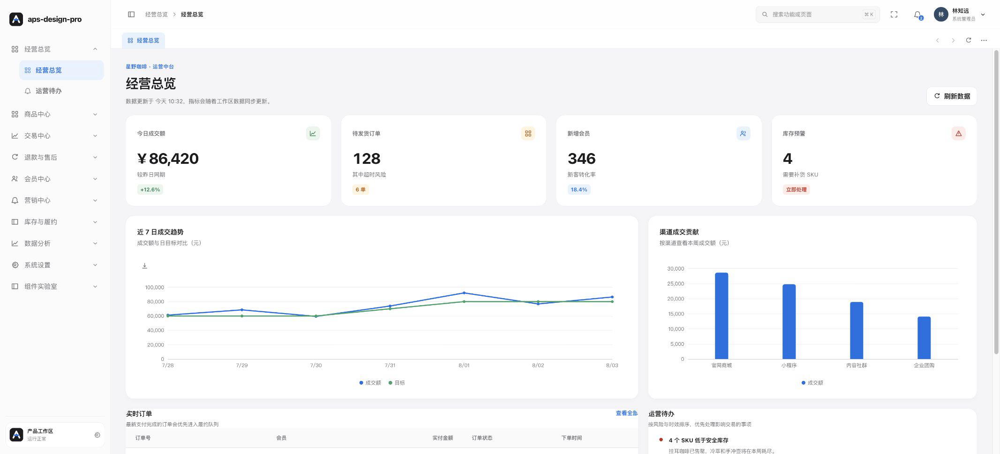

# APS Design Pro 后台演示

基于 Vue 3 和 `aps-design-pro` 搭建的电商运营中台示例。项目用完整的业务页面展示组件库在真实后台工作流中的组合方式，包括经营总览、商品、交易、售后、会员、营销、库存、数据分析、系统设置和组件实验室。

官网与组件文档：[https://apsdesignpro.com/](https://apsdesignpro.com/)

## 页面截图



截图来自本地登录后的经营总览页面，包含侧边栏、面包屑、页签、指标卡、ECharts 图表、实时订单和运营待办。

## 业务模块

| 一级菜单 | 示例页面 |
| --- | --- |
| 经营总览 | 经营总览、运营待办 |
| 商品中心 | 商品与 SKU、分类与品牌、规格模板 |
| 交易中心 | 交易订单、导出任务、订单详情 |
| 退款与售后 | 退款审核、售后工单 |
| 会员中心 | 会员列表、会员分群 |
| 营销中心 | 营销活动、优惠券中心 |
| 库存与履约 | 库存概览、仓库管理 |
| 数据分析 | 经营分析、商品分析 |
| 系统设置 | 用户管理、角色权限、菜单配置 |
| 组件实验室 | 组件能力预览、表单与日期、表格与图表、反馈与流程 |

组件实验室覆盖搜索、表单、日期时间、树形选择、上传、图表、表格设置、列冻结、拖拽列宽、可编辑表格、导入导出、浮层和加载状态等组合场景。

## 本地运行

环境要求：Node.js 18+、pnpm 9+。

```bash
pnpm install
pnpm dev
```

访问 Vite 输出的地址即可。默认登录页是 `/login`，登录成功后进入 `/dashboard`。演示账号：

```text
账号：admin
密码：demo123
```

## 构建与预览

```bash
pnpm typecheck  # Vue/TypeScript 类型检查
pnpm build      # 类型检查并构建静态文件
pnpm preview    # 预览 dist 目录
```

构建结果位于 `dist/`，可以部署到静态服务器。项目使用 `createWebHistory`，生产服务器需要将未知路径回退到 `index.html`。

## 一键清理为开发骨架

当不再需要演示业务页面时，可使用内置脚本把项目收敛为可直接开发的最小后台骨架。清理后只保留单一的“经营总览”菜单和页面、应用外壳、统一请求客户端、请求/响应拦截器、全局加载状态与消息提示；业务页面、系统页、组件实验室、mock 数据和 mock adapter 都会删除。

```bash
pnpm scaffold:clean:preview # 先预览清理范围
pnpm scaffold:clean         # 执行清理
```

正式执行会检测 Git 工作区是否存在未提交改动，避免意外覆盖；先提交或暂存即可继续。清理后的首页默认是公开的 `/dashboard`，无需后端或 mock 即可打开。

## 数据与接口契约

页面通过统一的客户端适配层读取本地 JSON 数据，调用方式与未来接入真实后端保持一致。响应体统一包含：

```ts
interface ApiResponse<T> {
  code: number;
  message: string;
  data: T;
  timestamp: number;
}
```

数据文件位于 `src/mock/`，客户端和页面之间通过 `src/api/client.ts` 交互。替换为 Axios、Fetch 或其他请求库时，只需要替换适配层，不需要改动页面组件。

## 目录结构

```text
aps-design-admin-demo/
├── src/api/          # 统一请求客户端与 JSON 适配器
├── src/layouts/      # 后台壳层、侧边栏、Header、页签和偏好设置
├── src/mock/         # 登录、菜单、订单、商品和系统数据
├── src/stores/       # 认证、反馈、网络状态、页签和应用偏好
├── src/views/        # 业务页面、系统页面和组件实验室
├── src/types/        # API、业务实体和表格类型
└── src/composables/  # 页面级数据源和复用逻辑
```

## 依赖组件库

项目直接安装 npm 上的 `aps-design-pro`，不依赖组件库源码目录：

```json
{
  "dependencies": {
    "aps-design-pro": "^0.1.2"
  }
}
```

在入口文件引入主题样式：

```ts
import "aps-design-pro/style.css";
```

组件库源码、API 和版本发布请查看 [aps-design-pro](https://gitee.com/xhyym/aps-design-pro)。

## 相关链接

- [官网与组件文档](https://apsdesignpro.com/)
- [组件库源码](https://gitee.com/xhyym/aps-design-pro)
- [npm：aps-design-pro](https://www.npmjs.com/package/aps-design-pro)

## 开源许可

本项目采用 [MIT License](./LICENSE) 开源。
